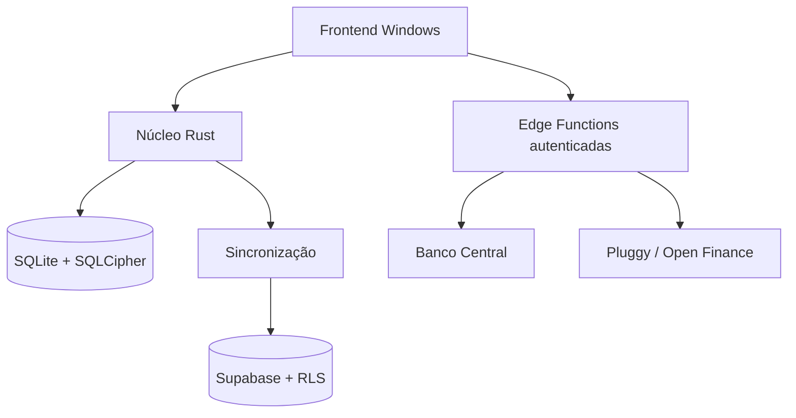

# Finança Simples — arquitetura offline-first

## Princípio

O aplicativo Windows é o produto principal. A internet amplia as capacidades, mas não é requisito para abrir o programa, consultar dados já sincronizados ou executar a operação financeira essencial.

O Finança Simples é independente do sistema Seja Doce. Produtos, precificação, estoque, funcionários e folha não pertencem a este repositório.

## Camadas

O SQLite é a base primária do dispositivo. O Supabase replica entidades autorizadas por workspace, e as Edge Functions intermediam integrações que exigem execução no servidor.

## Disponibilidade

| Função | Offline | Online |
|---|---|---|
| Abrir e autenticar no dispositivo conhecido | Completo | Completo |
| Consultar e alterar lançamentos | Completo | Completo + sincronização |
| Contas, cartões, categorias e transferências | Completo | Completo + sincronização |
| Dashboards mensal, anual e analítico | Completo | Completo |
| Carteira, metas, Aurora e simuladores | Completo com dados salvos | Completo + indicadores atualizados |
| Open Finance | Últimos dados sincronizados | Consentimento e sincronização ativa |
| Indicadores BCB | Último valor salvo, com data | Atualização pelo servidor |
| Backup e exportações | Completo | Completo |
| Atualizações do app | Versão instalada permanece funcional | Busca e instala pacote assinado |

## Banco local

- `foreign_keys = ON`;
- journal WAL e `busy_timeout`;
- valores monetários em centavos inteiros;
- IDs UUID para entidades locais;
- exclusões sincronizáveis por tombstone;
- datas ISO 8601;
- banco SQLCipher no Windows;
- chave local protegida por DPAPI no escopo do usuário;
- backup consistente antes de atualização.

## Sincronização

Cada entidade contém versão, estado de sincronização e data de atualização. Alterações locais são enviadas quando a sessão online existe; alterações remotas autorizadas são aplicadas no SQLite.

Política atual de conflito:

- a versão mais alta vence;
- no empate, a atualização mais recente é usada;
- dados pendentes locais não são sobrescritos por uma cópia remota mais antiga;
- permissões são verificadas antes de upload e pela RLS no servidor.

## Cache de integrações

Contas e faturas Open Finance, além dos indicadores BCB, são salvos como entidades do workspace. No modo offline, a interface exibe a data da última sincronização e não apresenta o cache como uma consulta em tempo real.

## Segurança

- Credenciais Pluggy ficam somente nas Edge Functions.
- A chave secreta/service role do Supabase não entra no cliente.
- O token temporário do widget Open Finance permanece em memória.
- Cada chamada avançada valida JWT, membership e permissão do módulo.
- O CSP permite somente os endpoints necessários do Supabase e do widget Pluggy.
- Atualizações automáticas exigem assinatura Tauri válida.

## Regra de desenvolvimento

Nenhuma função essencial pode depender de redirecionamento, iframe obrigatório ou carregamento do site hospedado.

Uma versão só pode ser promovida se:

1. os testes financeiros e Rust passarem;
2. o frontend e as configurações forem validados;
3. o instalador compilar em Windows;
4. o executável permanecer aberto no smoke test;
5. o banco anterior puder ser aberto sem perda de dados;
6. a aplicação continuar funcional sem os serviços remotos.
